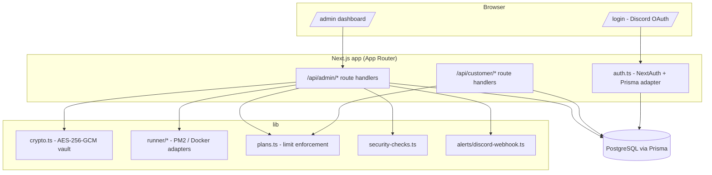

<div align="center">

# BotFleet

**Open-source control plane for Discord bot fleets.**

Manage white-label Discord bots, worker processes, shards, health checks,
logs, alerts, and customer limits from one dashboard.

[](./LICENSE)
[](https://nodejs.org)
[](https://nextjs.org)
[](https://www.typescriptlang.org)
[](./CONTRIBUTING.md)

</div>

---

> **Status: early and under active development.** The data model, token
> vault, auth, full admin + customer API layer, dashboard UI, Docker Compose
> setup, and a mock-data seed script are all built and verified against a
> real Postgres database. See "Features" below for exactly what's real vs.
> stubbed vs. not built yet. Nothing here fakes metrics, stars, or usage.
>
> **This repo is also becoming a real distributed control plane** (agents
> on remote servers, a versioned protocol, scheduling, reconciliation) -
> see `docs/distributed-audit.md` for the honest baseline this started
> from and `docs/roadmap.md` for what's shipped vs. not started yet. The
> repo is now an npm workspace: `apps/control-plane` is everything
> described below; `packages/protocol` is a versioned message catalog
> (see `docs/protocol-reference.md`); `apps/agent` is a real standalone
> agent process that enrolls with a single-use admin-issued token and
> reconnects with a persisted credential after that - verified end-to-end
> against a live database and real running processes, see
> `docs/agent-enrollment.md` and `docs/agent-installation.md`.
> `packages/runtime-sdk` + `packages/adapter-discordjs`/`adapter-eris` let
> an independent bot process (only knowing a `botId` and a local socket
> path - never a control-plane credential) report status through its
> agent, verified end-to-end with a real running agent/gateway and a real
> `discord.js`/`Eris` client - see `docs/runtime-sdk.md`.
> `packages/workload-spec` (`docs/workload-spec.md`) is a versioned,
> validated spec (command+args as an argv array - never a shell string)
> an admin assigns to an agent, which really executes it: verified
> end-to-end with a real spawned OS process, a real `SIGTERM` shutdown,
> and a real `SIGKILL` force-kill after its grace period.

## Why BotFleet

Most Discord bot developers start with one bot. Once you have 10, 20, or 100

- tokens, restarts, logs, customers, guild limits, shards, health checks,
  crashes, billing plans, and deployments all become chaos. BotFleet is meant
  to become the open-source control plane for that: a bot registry, an
  encrypted token vault, a fleet dashboard, worker/shard management, a
  white-label customer portal, plan enforcement, alerts, and a security
  center - all self-hostable.

## Features

**Built and working today:**

- 🔐 **Encrypted token vault** - bot tokens are encrypted at rest with
  AES-256-GCM, decrypted only inside the trusted server runtime, and never
  returned by any API response (not even redacted).
- 🗄️ **Full fleet data model** - customers, bots, bot health, workers,
  worker assignments, shards, audit logs, alerts, webhook destinations, and
  deployments, via Prisma migrations against PostgreSQL.
- 🔑 **Discord OAuth admin login** - sign in with Discord; the first
  allowlisted Discord user ID is promoted to owner automatically.
- 🧑‍💼 **Full admin API** - fleet overview metrics, bot CRUD, start/stop/
  restart/rotate-token, worker management, logs, alerts + Discord webhook
  test, and a real security score endpoint.
- 👤 **Working customer portal API** - any signed-in user who owns a
  customer record can list/view their own bots, see plan limits, and
  restart their bot if their plan allows it - fully isolated from other
  customers' data and from admin tooling.
- 📋 **Plan/limit enforcement** - free/starter/pro/enterprise tiers cap bot
  count, guild count, and shard count; enforced server-side on create/update.
- 🚨 **Discord alert webhooks** - alerts post as embeds with mass mentions
  always disabled (`allowed_mentions.parse = []`).
- 🛡️ **Security center checks** - a real, dynamically computed report (key
  configured, admin configured, OAuth configured, CSP enabled, etc.) - not a
  hardcoded score.
- 🖥️ **Full dashboard UI** - Fleet Overview, Bots (list + detail + actions),
  Workers, Customers, Logs, Alerts, Security, Deployments, and a public
  `/status` page, all rendering real data from Postgres.
- 🐳 **Docker Compose** - app + Postgres + Redis, plus a multi-stage,
  non-root production `Dockerfile`.
- 🌱 **Mock-data seed script** - `prisma/seed.ts` generates fake customers,
  bots, workers, shards, and alerts for local development; never reads or
  depends on real production data.
- 🧭 **Setup wizard** - `/setup` is a real first-run checklist (database,
  encryption key, Discord OAuth, admin allowlist, first worker/bot), each
  step reflecting live env/DB state, not a canned flow. `/` redirects here
  automatically until an owner account exists.
- 👥 **Admin promotion UI** - `/admin/users` lets an owner change any
  user's role; the last remaining owner can never be demoted.
- ⚖️ **Worker rebalancing recommendations** - a real, deterministic
  algorithm (`lib/rebalance.ts`) flags unassigned bots and over-capacity
  workers and recommends specific moves; applying one is a click away on
  the bot's detail page.
- 🧩 **Plugin system** - a real extension point
  ([`lib/plugins/types.ts`](./apps/control-plane/lib/plugins/types.ts)) for dashboard cards,
  Security Center checks, alert rules, bot templates, and deployment
  hooks. Ships with 6 working built-in plugins (Redis connectivity card,
  PM2/Docker runner deployment hooks, two alert rules evaluated against
  live bot health, a Node.js version health check, and discord.js/Eris bot
  templates) - browse them at `/admin/plugins`.
- 🤖 **AI worker queue** - a real BullMQ/Redis queue
  ([`lib/queue/`](./apps/control-plane/lib/queue/)), consumed by a separate worker process
  (`npm run worker:ai`) so analysis never blocks a request handler. Ships
  with one working task, "explain this crash" (a button on the bot detail
  page), which is genuinely queued/cached/advisory but uses a small,
  honest rule-based analyzer (not an LLM call - see
  [`lib/queue/crash-analysis.ts`](./apps/control-plane/lib/queue/crash-analysis.ts) for
  exactly why, and how to swap in a real one later without touching the
  queue or API routes). The job payload is only ever a bot ID and an
  already-redacted error string - never a token.
- ⏱️ **Scheduled alert rule evaluation** - the same worker process also
  runs a real BullMQ repeatable job (`lib/queue/scheduler-queue.ts`) that
  evaluates every alert rule every 5 minutes, on top of the manual button
  at `/admin/plugins` - both call the same
  [`lib/alerts/evaluate-rules.ts`](./apps/control-plane/lib/alerts/evaluate-rules.ts) so
  there's exactly one code path, not two that could drift apart.
- 🚀 **Deployment manager** - "Trigger deployment" at `/admin/deployments`
  creates a real `Deployment` row and runs every registered plugin's
  `beforeDeploy()`/`afterDeploy()` hook (see
  [`lib/plugins/builtin/runner-plugins.ts`](./apps/control-plane/lib/plugins/builtin/runner-plugins.ts)),
  transitioning `pending -> in_progress -> success/failed` for real, with
  each hook writing its own audit log entry.
- ⚙️ **Real process control (PM2 mode)** - `/admin/bots/:id` start/stop/
  restart actually spawns/stops/restarts a real OS process per bot via the
  `pm2` npm package (see
  [`lib/runner/pm2-adapter.ts`](./apps/control-plane/lib/runner/pm2-adapter.ts)), with the
  bot's token decrypted in-memory and passed as an env var, never logged.
  Verified end-to-end: a real process came up (visible in `pm2 list` with
  an actual PID), emitted heartbeat logs, and was cleanly torn down.
- 🧹 **Worker draining** - "Drain" on `/admin/workers`
  ([`lib/workers/drain.ts`](./apps/control-plane/lib/workers/drain.ts)) actually moves every
  bot off a worker onto other online workers with spare capacity (reusing
  the rebalance algorithm), then marks it offline once empty. Bots that
  can't be moved are reported as "stranded", not silently dropped.
- 🚧 **Safe maintenance mode** - a toggle on `/admin/settings`
  ([`lib/system-state.ts`](./apps/control-plane/lib/system-state.ts)) backed by a real DB row.
  While enabled, customer-triggered restarts return `503`, the public
  [`/status`](./apps/control-plane/app/status/page.tsx) page shows "Scheduled maintenance",
  and every admin page shows a banner - verified end-to-end against the
  live database in both directions.
- 🔁 **Staggered restarts on deployment** - "Trigger deployment" now
  queues a real BullMQ job per currently-online bot
  ([`lib/queue/restart-queue.ts`](./apps/control-plane/lib/queue/restart-queue.ts)), 15s
  apart, each one restarting via the same PM2/Docker runner used
  everywhere else - never blocking the deployment request. Each job
  re-checks maintenance mode and worker status right before running, and
  skips itself if either has changed. Verified end-to-end with a running
  `worker:ai` process: real PM2 restarts fired on schedule, and jobs
  correctly self-skipped when maintenance mode was toggled on mid-test.

**Explicitly stubbed / not fully verified here, said plainly:**

- **Docker mode**'s runner ([`lib/runner/docker-adapter.ts`](./apps/control-plane/lib/runner/docker-adapter.ts))
  is implemented the same way as PM2 mode using `dockerode`, and the
  client's connection to a real Docker daemon was verified - but the full
  create-container flow couldn't be run end-to-end in this sandbox
  (its network policy blocks pulling `node:20-slim` from Docker Hub).
  Verify with `npm run worker:build-image` in an environment with normal
  registry access before relying on it.
- The placeholder `worker-runtime/bot-process.js` process is not a real
  discord.js/Eris client - see
  [`lib/plugins/builtin/bot-templates.ts`](./apps/control-plane/lib/plugins/builtin/bot-templates.ts)
  for what a real one looks like; wiring one in is the natural next step
  (it just needs a real Discord bot token to test against).
- Rebalancing only recommends - nothing moves automatically.
- The AI worker's crash analysis is rule-based, not a real LLM call (see
  above) - it only runs when someone clicks "Explain this crash".

## Architecture



## Quickstart

This is an npm workspace: `apps/control-plane` is the Next.js dashboard/API
(the only app that exists today - see `docs/distributed-audit.md` and
`docs/roadmap.md` for what's next). Install once from the repo root;
`.env` lives inside `apps/control-plane` since that's the only app reading
one so far.

```bash
git clone https://github.com/timeout187/botfleet.git
cd botfleet
npm install

cp apps/control-plane/.env.example apps/control-plane/.env
# edit apps/control-plane/.env: DATABASE_URL, BOTFLEET_ENCRYPTION_KEY,
# AUTH_DISCORD_ID/SECRET, AUTH_SECRET, BOTFLEET_ADMIN_DISCORD_IDS

npm run --workspace @botfleet/control-plane -- prisma migrate deploy
npm run dev
```

`npm run dev` (from the repo root) runs the control plane's dev server;
every root script (`build`, `lint`, `typecheck`, `test`, `verify`, ...)
delegates to the relevant workspace the same way - see the root
`package.json`.

Generate the two required secrets:

```bash
openssl rand -base64 32   # BOTFLEET_ENCRYPTION_KEY
openssl rand -base64 32   # AUTH_SECRET
```

Create a Discord OAuth app at the
[Discord Developer Portal](https://discord.com/developers/applications),
add `http://localhost:3000/api/auth/callback/discord` as a redirect, and put
its client ID/secret in `apps/control-plane/.env`. Put your own Discord
user ID in `BOTFLEET_ADMIN_DISCORD_IDS` to be promoted to owner on first
sign-in.

Want mock data to look around with instead of an empty dashboard?

```bash
npm run --workspace @botfleet/control-plane -- prisma db seed
```

### Docker Compose

The compose file lives at the repo root; the control plane's Dockerfile
build context is the repo root too (it needs the workspace's
`package-lock.json`) - see `apps/control-plane/Dockerfile`.

```bash
cp apps/control-plane/.env.example apps/control-plane/.env   # fill in the same values as above
docker compose --env-file apps/control-plane/.env up --build -d
```

Runs the app, Postgres, Redis, and the AI worker (`worker-ai`) in
containers; migrations run automatically on the app container's start. If
`worker-ai` starts before migrations finish, it'll crash-loop briefly and
recover once the `app` container has migrated - restart policy handles it.

## Security model

- **Token vault**: AES-256-GCM, 32-byte key from `BOTFLEET_ENCRYPTION_KEY`.
  See [`lib/crypto.ts`](./apps/control-plane/lib/crypto.ts). Encrypted tokens never leave the
  server - no API route returns `tokenEncrypted`, not even masked.
- **Admin API**: every `/api/admin/*` route calls `requireAdmin()`, which
  returns a JSON 401/403 - it never redirects a fetch request to a login
  page. See [`lib/require-admin.ts`](./apps/control-plane/lib/require-admin.ts).
- **Customer isolation**: `loadOwnedBot()` only returns a bot if it belongs
  to a customer owned by the requesting user, and returns "not found" (not
  "forbidden") for both nonexistent and not-yours bots, so IDs can't be
  probed. See [`lib/require-customer.ts`](./apps/control-plane/lib/require-customer.ts).
- **CSP**: a restrictive Content-Security-Policy (no `unsafe-eval` in
  production) is set for every response in [`next.config.ts`](./apps/control-plane/next.config.ts).
- **Security Center**: `GET /api/admin/security` computes a real report from
  actual environment/DB state - see [`lib/security-checks.ts`](./apps/control-plane/lib/security-checks.ts).

Full write-up: [`docs/security.md`](./docs/security.md).

## Docs

- [`docs/architecture.md`](./docs/architecture.md) - layers, data model, auth model
- [`docs/security.md`](./docs/security.md) - token vault, authZ, CSP, known accepted risk
- [`docs/api-reference.md`](./docs/api-reference.md) - every admin/customer route
- [`docs/roadmap.md`](./docs/roadmap.md) - shipped / next / explicitly out of scope

## PM2 mode / Docker mode

Both runner modes exist as a `RunnerAdapter` interface (`lib/runner/`) with
explicit `TODO(real-runner)` stubs - see
[`docs/architecture.md`](./docs/architecture.md#why-bot-startstoprestart-dont-control-a-real-process-yet)
for exactly what's real today and what a real implementation still needs.

## Contributing

See [`CONTRIBUTING.md`](./CONTRIBUTING.md). This project is early-stage and
the shape of things is still settling - open an issue before a large PR.

## License

[MIT](./LICENSE).
