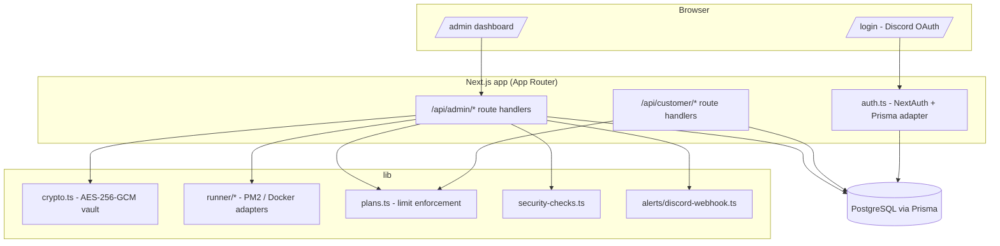

<div align="center">

# BotFleet

**Open-source control plane for Discord bot fleets.**

Manage white-label Discord bots, worker processes, shards, health checks,
logs, alerts, and customer limits from one dashboard.

[](./LICENSE)
[](https://nodejs.org)
[](https://nextjs.org)
[](https://www.typescriptlang.org)
[](./CONTRIBUTING.md)

</div>

---

> **Status: early and under active development.** The data model, token
> vault, auth, full admin + customer API layer, dashboard UI, Docker Compose
> setup, and a mock-data seed script are all built and verified against a
> real Postgres database. See "Features" below for exactly what's real vs.
> stubbed vs. not built yet. Nothing here fakes metrics, stars, or usage.

## Why BotFleet

Most Discord bot developers start with one bot. Once you have 10, 20, or 100

- tokens, restarts, logs, customers, guild limits, shards, health checks,
  crashes, billing plans, and deployments all become chaos. BotFleet is meant
  to become the open-source control plane for that: a bot registry, an
  encrypted token vault, a fleet dashboard, worker/shard management, a
  white-label customer portal, plan enforcement, alerts, and a security
  center - all self-hostable.

## Features

**Built and working today:**

- 🔐 **Encrypted token vault** - bot tokens are encrypted at rest with
  AES-256-GCM, decrypted only inside the trusted server runtime, and never
  returned by any API response (not even redacted).
- 🗄️ **Full fleet data model** - customers, bots, bot health, workers,
  worker assignments, shards, audit logs, alerts, webhook destinations, and
  deployments, via Prisma migrations against PostgreSQL.
- 🔑 **Discord OAuth admin login** - sign in with Discord; the first
  allowlisted Discord user ID is promoted to owner automatically.
- 🧑‍💼 **Full admin API** - fleet overview metrics, bot CRUD, start/stop/
  restart/rotate-token, worker management, logs, alerts + Discord webhook
  test, and a real security score endpoint.
- 👤 **Working customer portal API** - any signed-in user who owns a
  customer record can list/view their own bots, see plan limits, and
  restart their bot if their plan allows it - fully isolated from other
  customers' data and from admin tooling.
- 📋 **Plan/limit enforcement** - free/starter/pro/enterprise tiers cap bot
  count, guild count, and shard count; enforced server-side on create/update.
- 🚨 **Discord alert webhooks** - alerts post as embeds with mass mentions
  always disabled (`allowed_mentions.parse = []`).
- 🛡️ **Security center checks** - a real, dynamically computed report (key
  configured, admin configured, OAuth configured, CSP enabled, etc.) - not a
  hardcoded score.
- 🖥️ **Full dashboard UI** - Fleet Overview, Bots (list + detail + actions),
  Workers, Customers, Logs, Alerts, Security, Deployments, and a public
  `/status` page, all rendering real data from Postgres.
- 🐳 **Docker Compose** - app + Postgres + Redis, plus a multi-stage,
  non-root production `Dockerfile`.
- 🌱 **Mock-data seed script** - `prisma/seed.ts` generates fake customers,
  bots, workers, shards, and alerts for local development; never reads or
  depends on real production data.
- 🧭 **Setup wizard** - `/setup` is a real first-run checklist (database,
  encryption key, Discord OAuth, admin allowlist, first worker/bot), each
  step reflecting live env/DB state, not a canned flow. `/` redirects here
  automatically until an owner account exists.
- 👥 **Admin promotion UI** - `/admin/users` lets an owner change any
  user's role; the last remaining owner can never be demoted.
- ⚖️ **Worker rebalancing recommendations** - a real, deterministic
  algorithm (`lib/rebalance.ts`) flags unassigned bots and over-capacity
  workers and recommends specific moves; applying one is a click away on
  the bot's detail page.
- 🧩 **Plugin system** - a real extension point
  ([`lib/plugins/types.ts`](./lib/plugins/types.ts)) for dashboard cards,
  Security Center checks, alert rules, bot templates, and deployment
  hooks. Ships with 6 working built-in plugins (Redis connectivity card,
  PM2/Docker runner deployment hooks, two alert rules evaluated against
  live bot health, a Node.js version health check, and discord.js/Eris bot
  templates) - browse them at `/admin/plugins`.

**Explicitly stubbed, with clear `TODO(real-runner)` markers in the code:**

- Bot start/stop/restart today update status in the database through a
  `RunnerAdapter` interface (PM2 and Docker adapters both exist) but don't
  yet spawn or control a real process. See
  [`lib/runner/pm2-adapter.ts`](./lib/runner/pm2-adapter.ts).
- Deployments has a real read view over the `deployments` table, but
  nothing triggers an actual deployment yet.
- Rebalancing only recommends - nothing moves automatically.
- Alert rules run on demand (a button at `/admin/plugins`), not on a
  schedule yet.

**Not built yet** (tracked in [`docs/roadmap.md`](./docs/roadmap.md)):

- AI worker queue.

## Architecture



## Quickstart

```bash
git clone https://github.com/timeout187/botfleet.git
cd botfleet
npm install

cp .env.example .env
# edit .env: DATABASE_URL, BOTFLEET_ENCRYPTION_KEY, AUTH_DISCORD_ID/SECRET,
# AUTH_SECRET, BOTFLEET_ADMIN_DISCORD_IDS

npx prisma migrate deploy
npm run dev
```

Generate the two required secrets:

```bash
openssl rand -base64 32   # BOTFLEET_ENCRYPTION_KEY
openssl rand -base64 32   # AUTH_SECRET
```

Create a Discord OAuth app at the
[Discord Developer Portal](https://discord.com/developers/applications),
add `http://localhost:3000/api/auth/callback/discord` as a redirect, and put
its client ID/secret in `.env`. Put your own Discord user ID in
`BOTFLEET_ADMIN_DISCORD_IDS` to be promoted to owner on first sign-in.

Want mock data to look around with instead of an empty dashboard?

```bash
npx prisma db seed
```

### Docker Compose

```bash
cp .env.example .env   # fill in the same values as above
export $(grep -v '^#' .env | xargs)
docker compose up --build -d
```

Runs the app, Postgres, and Redis (reserved for a future AI worker queue,
not wired up yet) in containers; migrations run automatically on start.

## Security model

- **Token vault**: AES-256-GCM, 32-byte key from `BOTFLEET_ENCRYPTION_KEY`.
  See [`lib/crypto.ts`](./lib/crypto.ts). Encrypted tokens never leave the
  server - no API route returns `tokenEncrypted`, not even masked.
- **Admin API**: every `/api/admin/*` route calls `requireAdmin()`, which
  returns a JSON 401/403 - it never redirects a fetch request to a login
  page. See [`lib/require-admin.ts`](./lib/require-admin.ts).
- **Customer isolation**: `loadOwnedBot()` only returns a bot if it belongs
  to a customer owned by the requesting user, and returns "not found" (not
  "forbidden") for both nonexistent and not-yours bots, so IDs can't be
  probed. See [`lib/require-customer.ts`](./lib/require-customer.ts).
- **CSP**: a restrictive Content-Security-Policy (no `unsafe-eval` in
  production) is set for every response in [`next.config.ts`](./next.config.ts).
- **Security Center**: `GET /api/admin/security` computes a real report from
  actual environment/DB state - see [`lib/security-checks.ts`](./lib/security-checks.ts).

Full write-up: [`docs/security.md`](./docs/security.md).

## Docs

- [`docs/architecture.md`](./docs/architecture.md) - layers, data model, auth model
- [`docs/security.md`](./docs/security.md) - token vault, authZ, CSP, known accepted risk
- [`docs/api-reference.md`](./docs/api-reference.md) - every admin/customer route
- [`docs/roadmap.md`](./docs/roadmap.md) - shipped / next / explicitly out of scope

## PM2 mode / Docker mode

Both runner modes exist as a `RunnerAdapter` interface (`lib/runner/`) with
explicit `TODO(real-runner)` stubs - see
[`docs/architecture.md`](./docs/architecture.md#why-bot-startstoprestart-dont-control-a-real-process-yet)
for exactly what's real today and what a real implementation still needs.

## Contributing

See [`CONTRIBUTING.md`](./CONTRIBUTING.md). This project is early-stage and
the shape of things is still settling - open an issue before a large PR.

## License

[MIT](./LICENSE).
