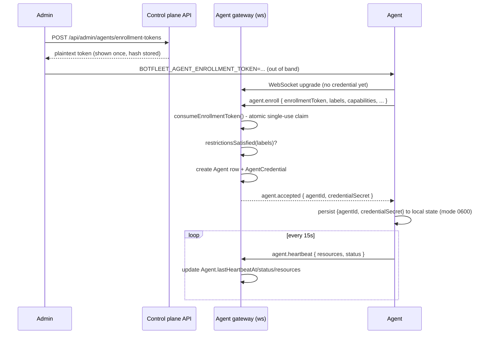

# Agent Enrollment

How a brand-new `apps/agent` process becomes a trusted `Agent` row the
control plane can talk to. See `docs/distributed-audit.md` for why this
didn't exist before and `docs/protocol-reference.md` for the message
shapes referenced below.

## Flow

## Enrollment tokens (`lib/agents/enrollment.ts`)

- Created via `POST /api/admin/agents/enrollment-tokens` (admin-only,
  audited). Optional `environment` and `requiredLabels` restrictions scope
  which agents can redeem it.
- Stored only as a SHA-256 hash (`EnrollmentToken.tokenHash`) - the
  plaintext is returned exactly once, in that API response.
- Single-use, enforced atomically: `consumeEnrollmentToken()` claims a
  token with one conditional `UPDATE ... WHERE tokenHash = ? AND usedAt
IS NULL AND expiresAt > now()`, not a read-then-write pair, so two
  connections racing to redeem the same token can't both succeed.
- Expires after `ttlMinutes` (default 30). A used, expired, or unknown
  token is rejected with a distinct reason (`already_used` / `expired` /
  `not_found`) - the agent sees this and logs it, but keeps retrying with
  backoff rather than crashing (see docs/agent-installation.md).
- Restriction mismatches (`restrictionsSatisfied()` in
  `lib/agents/enrollment.ts`) still burn the token - a rejected agent
  can't retry against the same one.

## Agent credentials (`lib/agents/credential.ts`) - disclosed, not mTLS

**This is explicitly not mutual TLS.** On successful enrollment, the
gateway issues a random 256-bit bearer secret and records only its SHA-256
fingerprint (`AgentCredential.fingerprint`) - the plaintext is sent to the
agent exactly once, in the `agent.accepted` message. Every reconnect after
that presents `Authorization: Bearer <agentId>:<secret>` during the
WebSocket handshake; the gateway verifies it (`AgentCredentialProvider.verify()`)
_before_ the upgrade completes.

Production hardening (tracked in `docs/roadmap.md`) means replacing this
with real mTLS client certificates issued by a CA the control plane
controls. `AgentCredentialProvider` is deliberately a narrow interface so
that swap is a new provider implementation, not a rewrite of every call
site - see the mission's Phase 4 note on why a "secure provider interface"
was the honest choice for this pass instead of claiming a from-scratch
mTLS implementation is production-grade when it wasn't fully built and
verified.

## Verified end-to-end

Against a live Postgres + the real `agent-gateway`/`agent` processes (not
mocked):

- Fresh enrollment: real `Agent` row created with real host metrics
  (hostname, architecture, actual free/total memory, actual disk stats via
  `fs.promises.statfs`), `AgentCredential` issued, local state file written
  with mode `0600`.
- Heartbeats: `lastHeartbeatAt` and `cpuUsagePercent` (real idle/total CPU
  tick sampling, not a load-average approximation) advance every ~15s.
- Clean shutdown (`SIGTERM`): agent closes its socket, gateway flips
  `Agent.status` to `disconnected` immediately.
- Reconnect: a second run with no enrollment token, only the persisted
  credential, re-authenticates via the `Authorization` header and reuses
  the **same** `agentId` - confirmed exactly one `Agent` row exists after
  reconnecting, not a duplicate.
- Replay: re-running with an already-consumed enrollment token is
  rejected every attempt (`already_used`), and the agent retries forever
  with exponential backoff rather than giving up - and no orphaned `Agent`
  row is left behind from the failed attempt.
- Restrictions: a token created with `{ environment: "production" }`
  rejects an agent declaring `environment: "staging"` - and the token is
  still burned (can't be retried).
